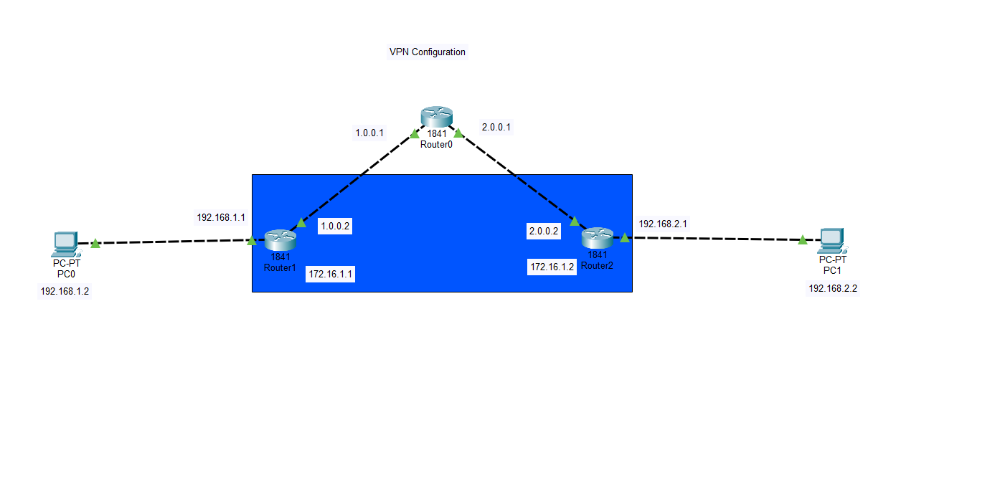
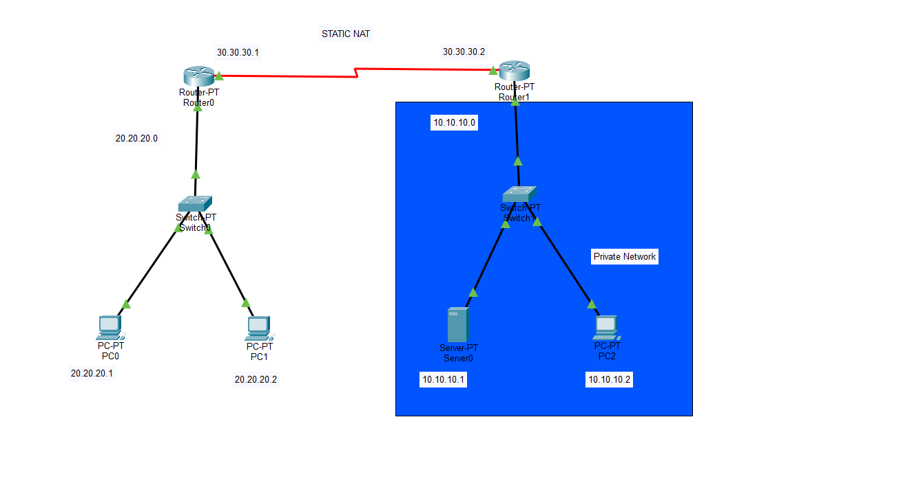

# Secure Services & Protocol Analytics Gateway

This project demonstrates the implementation of essential network services and security layers required to protect and manage a modern enterprise environment.

## Project Scope
This repository contains a suite of labs focused on securing the network edge and automating internal services.

### 1. Security & Edge Connectivity
- **VPN Basics:** Site-to-site or Remote Access tunnel configuration for encrypted communication.
- **Static NAT:** Mapping private internal server IPs to public IPs for secure external access.
- **VLANs:** Layer 2 segmentation to isolate departmental traffic (e.g., HR vs. Guest).

### 2. Infrastructure Services
- **DHCP & DNS:** Automated IP addressing and hostname resolution for end-users.
- **RIP Routing:** Dynamic routing for small-to-medium internal network segments.
- **TCP/UDP Analysis:** Testing and verifying transport layer protocols for web and data traffic.

## VPN Topology Preview

## NAT Topology Preview

## Technical Skills Used
- IPsec/VPN Tunneling
- Network Address Translation (NAT)
- Layer 2 Switching & VLAN Trunking
- Protocol Header Analysis (TCP/UDP)
